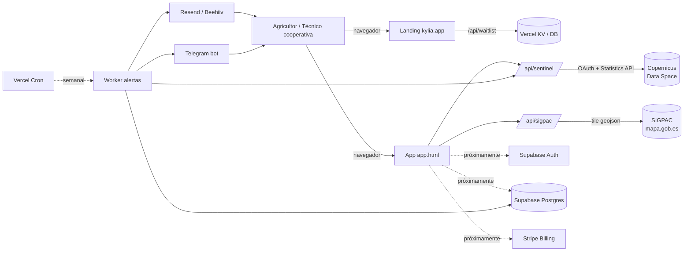

# Arquitectura de Kylia

Documento técnico para devs y para futuros consultores. Una sola página, sin literatura.

## Visión de alto nivel

## Componentes hoy

| Componente | Tecnología | Estado | Notas |
|------------|-----------|--------|-------|
| Landing      | HTML estático + JS vanilla | producción | `index.html`, `precios.html`, `cooperativas.html` |
| App parcelas | HTML + Leaflet + JS vanilla | producción | `app.html`, almacena selección en localStorage |
| API SIGPAC   | Node serverless (Vercel) | producción | `/api/sigpac.js` — tile lookup por lat/lon |
| API Sentinel | Node serverless (Vercel) | producción | `/api/sentinel.js` — Copernicus DataSpace OAuth + Statistics API |
| Waitlist     | Node serverless (Vercel) | producción | `/api/waitlist.js` — captura emails pre-launch |

## Componentes próximos (orden de prioridad)

1. **Auth**: Supabase Auth con email + magic link. Obligatorio para guardar parcelas en servidor en vez de localStorage.
2. **DB**: Postgres en Supabase con `db/schema.sql` aplicado.
3. **Cron + alertas**: Vercel Cron semanal que recorre todas las parcelas activas, llama Sentinel y dispara alertas si hay umbral cruzado.
4. **Stripe Billing**: planes Free / Pro 100 / Pro 500. Cooperativa y Enterprise se siguen vendiendo manualmente.
5. **Telegram bot**: bot transactional `@kylia_alertas_bot` para alertas push.
6. **Webhooks**: Stripe → activación/desactivación plan.

## Decisiones técnicas explicadas

**¿Por qué HTML estático y no Next/React?**
La landing se actualiza ~1 vez a la semana. Cargar React añadiría 80-150 KB para un beneficio nulo. La app (`app.html`) sí podría ser React si crece — hoy es JS vanilla y rinde mejor en móvil 3G de campo, que es nuestro caso de uso real.

**¿Por qué Vercel y no AWS?**
Cero ops. Mientras el cron semanal y los endpoints sean ligeros, la free tier llega. Si pasamos los límites cambiamos solo el deploy target, el código serverless es portable.

**¿Por qué Supabase y no DynamoDB / Firebase?**
Postgres con PostGIS nativo. Las parcelas son geometrías y querer hacer "todas las parcelas dentro de esta provincia" en una NoSQL es masoquismo.

**¿Por qué Copernicus DataSpace y no Sentinel Hub Enterprise?**
Hoy: Copernicus DataSpace ofrece la Statistics API gratis con cuotas razonables (~30k requests/mes free). Cuando crezcamos a >1.000 usuarios activos pasaremos a Sentinel Hub Enterprise S (250 €/mes) por su mayor cuota y SLA.

**¿Por qué localStorage para las parcelas en lugar de servidor?**
Es temporal mientras no haya auth. Cuando entre Supabase Auth movemos las parcelas a la tabla `parcelas` y dejamos localStorage como cache offline.

**¿Por qué Telegram en vez de WhatsApp Business?**
WhatsApp Business cobra por mensaje activo (notificación) y requiere aprobación de plantillas. Telegram bot es gratis y los agricultores objetivo (40-60 años) ya están en grupos de Telegram agrícolas.

## Datos sensibles y RGPD

- Sin datos personales en el frontend más allá del email de waitlist y la sesión.
- Las geometrías SIGPAC y los índices Sentinel-2 son datos públicos, no personales.
- El email del usuario y la lista de parcelas suya sí son datos personales — protegidos por RLS en Postgres y solo accesibles con el JWT del usuario.
- Logs en Vercel: 90 días de retención, IP hasheada antes de almacenar.

## Coste mensual estimado (año 1)

| Concepto | €/mes |
|----------|-------|
| Vercel Pro (cuando excedamos free) | 20 |
| Supabase Pro | 25 |
| Copernicus DataSpace | 0 (free tier) |
| Stripe (variable según facturación, ~2.5 % + 0.25 €) | ~10 |
| Resend (email transaccional 3.000/mes) | 0 (free) |
| Beehiiv (newsletter <2.500 subs) | 0 (free) |
| Dominio kylia.app prorrateado | ~1 |
| **Total**                     | **~56** |

A los 100 usuarios Productor pagando 99 €/año de media (ARPU realista ~150 €/año contando que algunos saltan al tier de 100-500 ha), ingreso bruto ~1.250 €/mes vs ~70 €/mes de coste = margen bruto ~94 %. Una sola Cooperativa Esencial (2.900 €/año) aporta más margen que 30 Productores. La estructura de costes solo se complica cuando entren los costes de Sentinel Hub Enterprise y, sobre todo, cuando contratemos a la primera persona.

## Disaster recovery

- **Backups**: Supabase hace snapshot diario, retención 30 días. Los exportamos también a S3 cifrado fuera de Supabase una vez por semana (script + GitHub Action) cuando entremos en planes Enterprise.
- **RPO**: ≤24 h. **RTO**: ≤4 h para volver a operar en otra región.
- **Plan B Sentinel**: si Copernicus DataSpace cae, fallback degradado a último valor en BD con flag "datos cacheados".
- **Plan B SIGPAC**: si MAPA cae, podemos cargar el shapefile descargado mensualmente (~3 GB) en una instancia local — degradado pero funcional.
